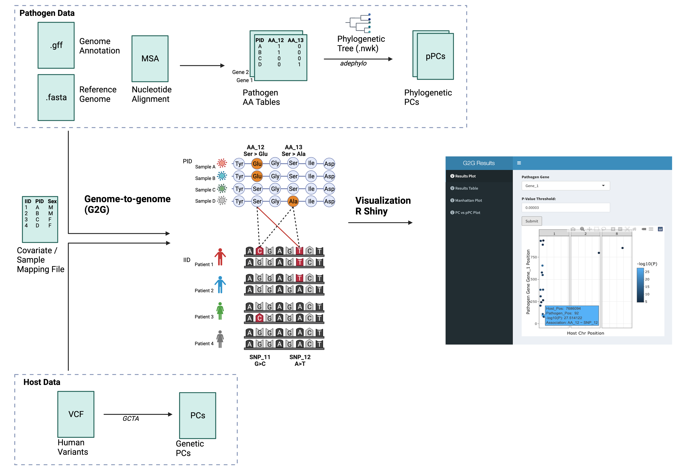

# Description
G2GSnake is a snakemake pipeline that conducts a genome-to-genome (G2G) study using paired human and pathogen genetic data. Associations between all human and pathogen variants are systematically tested. Principal components (pathogen and host) are used to correct for stratification. Results can be visualized using a R Shiny app that has been built in a docker container. 

More details can be found here: 



# Dependencies
## Snakemake
Snakemake requires conda to be installed. For Linux systems, this installer can be used: [Miniconda3-latest-Linux-x86_64.sh](https://docs.conda.io/projects/conda/en/latest/user-guide/install/linux.html) 

Download the installer and run:
```
bash Miniconda3-latest-Linux-x86_64.sh
```
After installing conda, install mamba which is required for snakemake
```
conda install -n base -c conda-forge mamba
```
Then install snakemake
```
conda activate base
mamba create -c conda-forge -c bioconda -n snakemake snakemake
```
Before running the pipeline, snakemake can be activated by 
```
conda activate snakemake
```

## Docker
Docker is required to run the pipeline and to launch the R Shiny app. Installation instructions are system dependent. More details can be found here: [Docker Installation](https://docs.docker.com/engine/install/)

# Input/Settings
The settings and file paths are specified in [config.yaml](config/config.yaml)
All input data should be stored in `raw_data`

## Pathogen Data
Pathogen data should be seperated by gene and stored in `raw_data/pathogen/`.

### File 1: Pathogen amino acid matrix (`raw_data/pathogen/AA_Table/<Gene_Name>.txt`)
A binary matrix indicating presence or absence of a amino acid variant. Should contain 0 (Presence), 1 (Absence), or NA (Missing)
First column should be PID. 

Example: [Gene_1.txt](raw_data/pathogen/AA_Table/Gene_1.txt)

### File 2: Pathogen variant file (`raw_data/pathogen/AA_Table/<Gene_Name>.info`)
A variant information file that maps Variant IDs to genes and positions. 
Columns should be ID, Gene, Pos

Example: [Gene_1.info](raw_data/pathogen/AA_Table/Gene_1.info)

### OPTIONAL File: Phylogenetic tree (`raw_data/pathogen/<File_Name>.nwk`)
A phylogenetic tree in newick format. Necessary if phylogenetic PCs are calculated instead of standard PCs. 

## Host Data
Host data should be stored in `raw_data/host/`.

### File 1: Host VCF file (`raw_data/host/<File_Name>.vcf.gz`)
   * Should contain host SNPs in all chromosomes. 
### File 2: Covars/Mapping File (`raw_data/<Covar_File_Name>.txt`)
   * First two column should be IID and PID. PID indicates ID in the pathogen amino acid matrix. IID indicates ID in the vcf file. Additional columns will be included as covariates in the G2G analysis. 

## Settings
The following settings can be specified in the [config.yaml](config/config.yaml) file:
### General Settings
1. `pathogen_input: "aa_tbl"
   * `fasta` option can also be used. A multipe-sequence nucleotide alignment in FASTA format is required. Mixed sites can be encoded as ambigious nucleotides. A reference genome (FASTA) file and annotation (GFF) file is also required. 
2. `tool: 'PLINK'
   * `SAIGE` option, slower but implements Generalized Linear Mixed Model that uses SPA. Much better for case-control imbalances (rare pathogen variants). Also, no host PCs usually required as covariates. See [SAIGE_Manuscript](https://doi.org/10.1038/s41588-018-0184-y)
### Pathogen Settings
1. `pPCA: false` 
   * Indicate `true` if phylogenetic PCs are preferred. A tree file must be provided
2. `N_pPC: <N_pPCs>`
   * The number of phylogenetic PCs to include. Can be 0
3. `pathogen_MAC: <MAC_Threshold>`
   * Pathogen variants with minor allele count (MAC) below the threshold will be filtered out 
4. `pathogen_missing: <Missing_Threshold>`
   * Pathogen variants with missingness above this proportion will be filtered out 
5. `genes: "<Gene_Name_1>,<Gene_Name_2>"`
   * The gene names seperated by a comma. This must correspond to the name of the amino acid matrix and variant file. 
6. `nw_file: <FILE_PATH>`
   * OPTIONAL. Path to newick tree if phylogenetic PC is specified. 
### Host Settings
1. `host_VCF: "../raw_data/host/<File_Name>.vcf.gz"`
   * Path to VCF file
3. `covar_file: "../raw_data/<Covar_File_Name>.txt"`
   * Path to covars/mapping file
5. `host_MAF: <MAF_Threshold>`
   * Host variants below this threshold will be filtered out. 
6. `host_missing: <Missing_Threshold>`
   * Host variants with missingness above this proportion will be filtered out 
7. `host_HWE: 1e-6`
   * Host variants that significantly deviate from Hardy-Weinberg equilibrium will be filtered out.  
8. `N_PC: <N_PCs>`
   * Number of host PCs to include. Can be 0
9. `excl_chr6: true`
   * Whether to exclude chr6 when calcuating PCs. Recommended to specify `true` if interested in HLA region

# Usage
Here are the steps to run the pipeline for a test dataset (included in this repository). For analysis with real data, please adjust paths and settings in [config.yaml](config/config.yaml) according to instructions in [Input/Settings](Input/Settings). All data needs to be stored in `raw_data/`. 

First step is to clone this repository:
```
git clone https://github.com/zmx21/G2GSnake.git
```
From this step on, we will be working in the `workflow` directory:
```
cd G2GSnake/workflow/
```
We can then run the G2GSnake pipeline. The number of cores can be adjusted by changing the `--cores` flag: 
```
conda activate snakemake
snakemake --use-singularity --cores 1 --singularity-args "-B ./results:/home/results,../raw_data:/raw_data,./scripts:/home/scripts"
```
To visualize the results, the R Shiny app can be launched: 
```
docker run --rm --publish 3838:3838 --mount type=bind,source="$(pwd)"/results,target=/home/results zmxu/g2g_shiny_docker
```
The GUI should appear in http://localhost:3838/, which can be viewed in any web browser. 

Raw summary statistics are stored in `workflow/results`, grouped based on pathogen gene. 

# Ackowledgements
Developers of [SAIGE](https://github.com/weizhouUMICH/SAIGE), a GWAS tool that is used in this pipeline

[Olivier Naret](https://github.com/onaret), whose [G2G-Simulator](https://github.com/onaret/G2G-Simulator) tool was used to construct the test dataset. 

[Sina Rüeger](https://github.com/sinarueeger), for code to calculate phylogenetic principal components

[Shweta Pipaliya](https://github.com/svpipaliya), for discussions regarding snakemake

